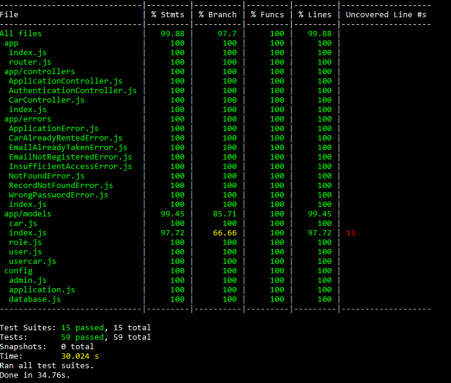

# BCR Backend API (Test Driven Development & Deployment Challenge)

This project is an individual challenge to build unit and integration tests from a given [express backend api project](https://github.com/erickyudha/car-rental-backend-api_raw) and deploying this app using [railway.app](railway.app).  

Unit and integration tests for this project is built using `jest` and `supertest`. Test coverage details can be seen [here](#test-coverage).  
Styling for this javascript project is enforced using ESLint [Google Javascript style guide](https://github.com/google/eslint-config-google).

This project is made as part of Binar Academy fullstack web development course.

## Live Application

This application is currently deployed using [railway.app](railway.app).  
You can access this application on [https://erick-rental.up.railway.app/](https://erick-rental.up.railway.app/)  
  
Information about server routes and documentation can be seen [here](#routes-and-documentation).

## Running Local App

To run this application in your computer you can follow these steps below.

### Setup Local Server and Database

    npm install

Run this command to install all dependencies needed by this project.

    npm run db:setup

After that, run this command to setup database with sequelize. Remember to setup `.env` file on this project first with your postgres database data, you can follow this example file [here](.env.example). Remember to have your postgres database installed and running first. 

**Run this database setup command twice, with different `NODE_ENV` settings in `.env` file.**   

1. `NODE_ENV=development` (this is the default setting), unit tests is using database in this environment.
2. `NODE_ENV=test`, integration tests is using database in this environment.

*This have to be done to ensure both unit and integration tests working correctly*  

### Running Server

    npm start

run this command to start express server normally. To run the server in development mode, use this command instead:

    npm run develop

To run both unit and integration tests, use this command:

    npm test

## Routes, Documentation, and Test Coverage

### Routes and Documentation

Documentation about API is available here:

| Route | Default Local Link | Live Link |
|--|--|--|
| `/documentation` | localhost:8000/documentation | https://erick-rental.up.railway.app/documentation/ |

Default admin account data is available and can be changed in local on [`config/admin.js`](config/admin.js) with this as default settings:

    {
      name: 'mr.admin',
      email: 'admin@binar.co.id',
      password: 'admin',
    }

### Test Coverage

Unit and integration tests coverage of this project is ***>97.7%***, details can be seen on this image below.

